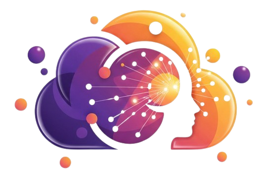

# 🎓 OFOQ (أفق) - The Smart Educational Ecosystem

  
  

## 📝 About The Project
**OFOQ** is a comprehensive, AI-driven educational platform designed to bridge the gap between physical and remote learning ecosystems. By integrating cutting-edge Artificial Intelligence (Computer Vision, NLP, and Speech-to-Text), OFOQ empowers educators and institutions to monitor engagement, automate lecture summarization, and ensure academic integrity during examinations.

### ✨ Key Features

* 🎙️ **AI Lecture Transcription & Summarization:** Real-time audio recording that automatically transcribes and summarizes lecture content using Hugging Face AI models, providing instant study materials for students.
* 👁️ **Focus Monitoring & Attendance Tracking:** Utilizes Computer Vision (YOLOv8, FaceNet) to dynamically track student attendance and calculate average focus levels during live sessions.
* 🛡️ **Smart Secure Proctoring:** An intelligent anti-cheat system that monitors student movement during exams. The system issues a warning upon detecting suspicious behavior and strictly terminates the session only after **3 consecutive alarms**, ensuring a fair testing environment.
* 👨‍🏫 **Role-Based Access Control:** Tailored portals for Students, Doctors, and Teaching Assistants (TAs). Specifically, TAs are granted dedicated access to seamlessly create practical exams and manage test cases.

---

## 🛠️ Tech Stack

**Frontend:**
* Angular (v16+) utilizing Signals & Advanced Routing
* TailwindCSS / SCSS for responsive UI
* MediaRecorder API for live audio streaming

**Backend:**
* .NET Core (RESTful APIs, Architecture)
* FastAPI (Python microservices for AI processing)
* Entity Framework Core

**Artificial Intelligence:**
* **Audio Processing:** Whisper / Hugging Face models
* **Computer Vision:** YOLOv8, FaceNet, MediaPipe
* **NLP:** Transformer & Attention mechanisms

---

## 🚀 Getting Started

To get a local copy up and running, follow these simple steps.

### Prerequisites
* Node.js & npm (for Angular Frontend)
* .NET SDK (for Backend)
* Python 3.9+ (for FastAPI & AI Models)
